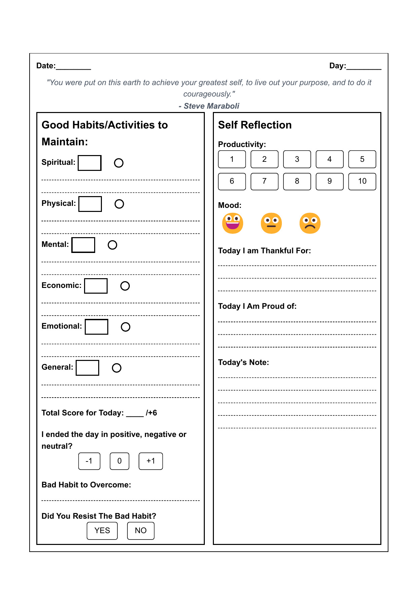
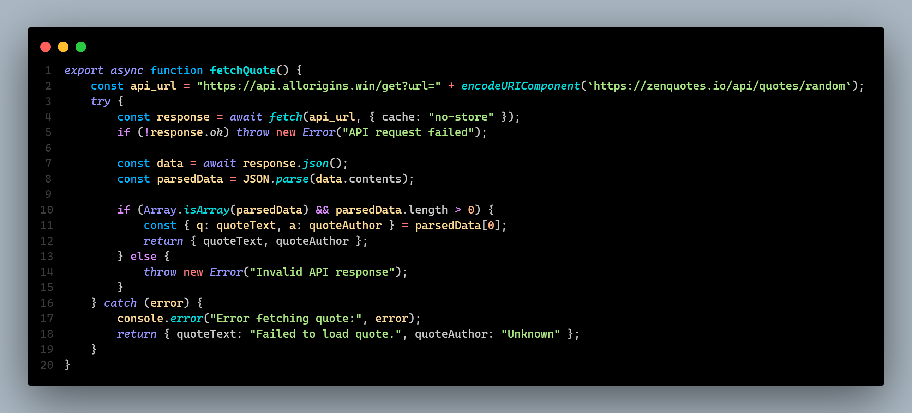

# 📝 Daily Reflection Journal

The **Daily Reflection Journal** is a web-based journaling app that helps users **track their daily habits, self-reflection, and productivity**. It provides a **printable format**, allowing users to maintain a personal journal offline. Additionally, the journal includes **random motivational quotes** to inspire users each day. 🚀

---
## 📋 Project Overview

This application serves as a digital journal that combines several key elements of personal growth:
- **Habit Tracking**: Monitor positive habits across different life domains
- **Self-Reflection**: Record daily mood, productivity, and personal reflections
- **Motivational Content**: Display random inspirational quotes via the ZenQuotes API
- **Print-Friendly Design**: Generate physical copies of journal entries


## **✨ Features**
✔ **Minimal & Clean UI** – A simple and intuitive layout for easy journaling.  
✔ **Random Motivational Quotes** – Fetches new quotes every time the page is refreshed.  
✔ **Daily Habit Tracking** – Write down and track habits with checkboxes.  
✔ **Self-Reflection Section** – Rate productivity, mood, and note daily experiences.  
✔ **Print-Ready Format** – A “Download as PDF” feature optimizes content for A4 printing.  
✔ **Mobile-Friendly** – Fully responsive and works on all screen sizes.  

### Journal Structure
- **Holistic Habit Tracking**:
  - Spiritual, Physical, Mental, Economic, Emotional and General categories
  - Checkbox tracking system with visual indicators
  - Daily scoring mechanism to quantify progress
- **Mood & Productivity Assessment**:
  - 1-10 productivity scale
  - Emoji-based mood tracking
  - Day outcome evaluation (positive/neutral/negative)
- **Guided Reflection Prompts**:
  - Gratitude section ("Today I am Thankful For")
  - Achievement recognition ("Today I Am Proud of")
  - Free-form journaling space

## 🛠️ Technical Implementation

### Structure
- **Multi-page Application**:
  - `index.html`: Homepage with navigation
  - `book.html`: Main journal interface
- **Modular JavaScript**:
  - `main.js`: Core functionality and event listeners
  - `apiService.js`: API interaction module

### Styling
- **Multiple CSS Files**:
  - `styles.css`: Main application styling
  - `prints.css`: Print-specific styling with media queries
- **Responsive Design**:
  - Mobile adaptations for small screens
  - Flex and grid-based layouts
  - Tailwind CSS utility classes

### API Integration
- **ZenQuotes Integration**:
  - CORS handling with AllOrigins proxy
  - Asynchronous data fetching
  - Error state management

---

## **📂 Project Structure**
```
daily-reflection-journal/
│
├── index.html          # Homepage with navigation
├── book.html           # Main journal interface
│
├── css/
│   ├── styles.css      # Main application styles
│   └── prints.css      # Print-specific styles
│
├── js/
│   ├── main.js         # Core functionality
│   └── apiService.js   # API service module
|
├── assets/
│   ├── image 1.png  
│   └── image 2.gif  
│
└── README.md           # Project documentation
```


---
## 🚀 Getting Started

1. Clone the repository
2. Open `index.html` in your browser to access the homepage
3. Navigate to the journal page via the "Book" link
4. Complete your daily reflection
5. Use the "Download as PDF" button to save a physical copy

## 💻 Development

```bash
# Clone the repository
git clone https://github.com/anasskhannn/Daily-Reflection-Journal.git

# Navigate to project directory
cd Daily-Reflection-Journal

# Open in browser (or use Live Server extension if you have VS Code)
# No build process required as this is a vanilla JavaScript project
```

---

## **🛠 Technologies Used**
| Technology      | Purpose |
|----------------|---------|
| **HTML5**      | Structuring content & pages |
| **CSS3**       | Styling and responsive layout |
| **JavaScript (ES6)** | Fetching quotes, UI interactions |
| **Tailwind CSS** | Utility-based styling framework |
| **ZenQuotes API** | Provides random motivational quotes |

---

## **🔧 Installation & Setup**
This is a **static project** and does **not** require any installation. Simply:
1. **Download or Clone** the repository.
2. **Open `index.html`** in a web browser.
3. **Enjoy your journaling experience!** 🎯

---

## **📷 Screenshots**

### **Journal Page**
📌 *Main journaling area with a daily reflection template.*

<div align="center">
    
</div>

### **Wire Map of the Project**
<div align="center">
    
</div>

### **Sample Code For Fetching the Quotes**
📌 *Fetching Random Quotes from Zen Quotes Api on Every New Refresh*
<div align="center">
    
</div>

### **Demo of Working**
<div align="center">
    
</div>

---

## **🌟 Future Improvements**
- [ ] Add **dark mode** support.  
- [ ] Allow **saving journal entries locally** in `localStorage`.  
- [ ] Enable **custom themes & fonts** for personalization.  
- [ ] Implement **automatic PDF generation** instead of browser print.  

---

## **📢 Attribution**
Quotes provided by **[ZenQuotes API](https://zenquotes.io/)** 🧘  
We extend our gratitude to **ZenQuotes** for offering daily inspiration through their free API.

---

💡 **Enjoy journaling and improving yourself every day!** ✨  
📧 For feedback or improvements, feel free to reach out! 🚀

---
Made with ❤️ by **Mohd Anas Khan**